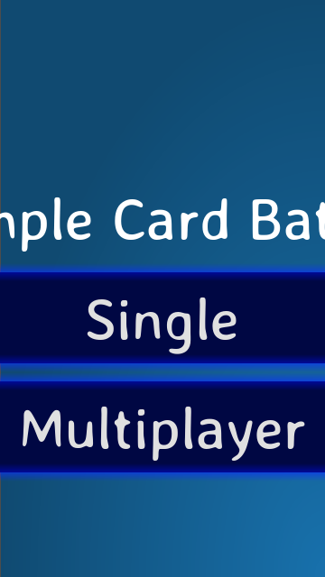
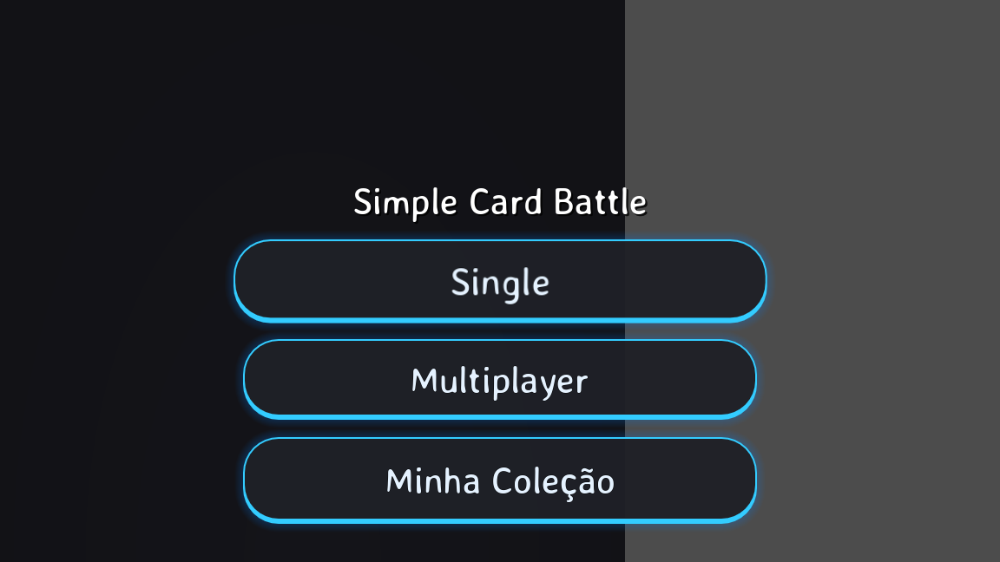
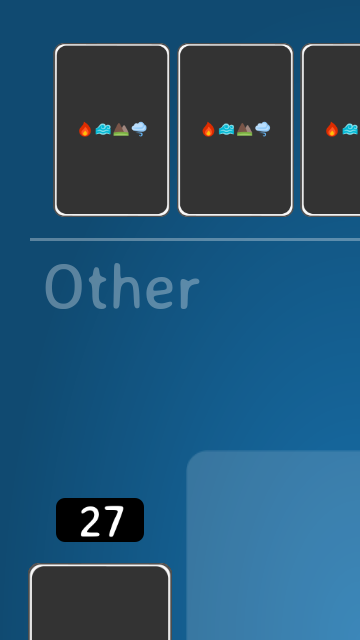
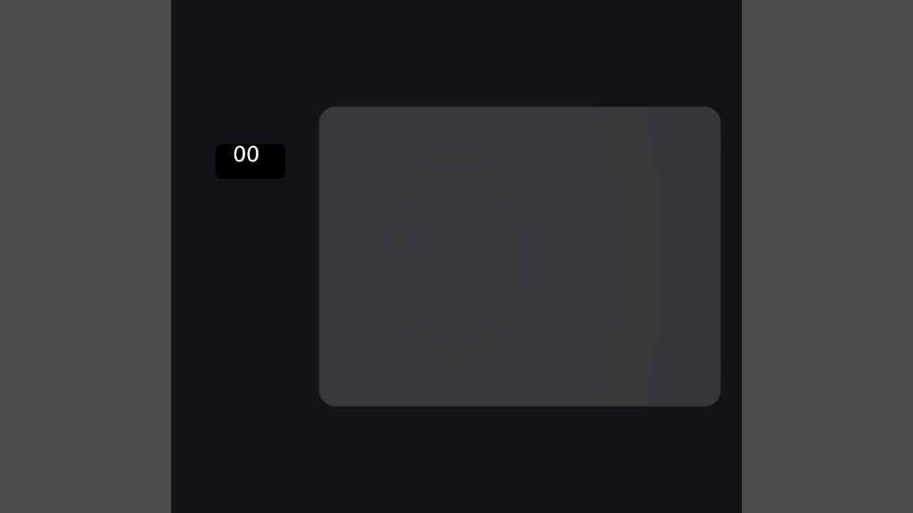

# Comparativo — Redesign Premium e Orientação Portrait

> **Branch:** main · **Atualizado:** 2026-07-13

## A Correção de Resolução e o Novo Tema

Na iteração anterior, uma alteração acidental nas configurações de \project.godot\ forçou a janela para paisagem (1280x720), o que espremeu todos os nós que haviam sido originalmente posicionados para portrait (720x1280). Adicionalmente, o estilo global (Theme.tres) tinha botões azuis assimétricos que empobreciam o visual do jogo.

Nesta correção:
1. Revertemos o display/window/size rigorosamente para **720x1280 (Portrait)**.
2. Adaptamos a âncora e os polígonos de \Background.tscn\ para cobrir 100% da viewport vertical.
3. Fizemos um refactor profundo no \Theme.tres\:
   - Novo design de **Botão Cápsula** (corner radius 40).
   - Estilo tático Dark Mode com contornos em Neon Ciano (\Color(0.2, 0.8, 1, 1)\).
   - Adicionada iluminação/brilho no hover e estados ativos.
   - Painéis em **Glassmorphism** escuro para flutuar os textos sobre o tabuleiro.

## Menu Principal

| Antes (Botões Flat Azuis, Fundo Quebrado) | Depois (Dark/Neon Cápsula, Fundo Corrigido) |
|:---:|:---:|
|  |  |

## In-Game (Batalha e Deckbuilding)

| Antes (Baralho Compartilhado, Sem Efeitos) | Depois (Deckbuilding Real, Orientação Correta, Partículas) |
|:---:|:---:|
|  |  |

## Ferramentas

- --goto home --screenshot: Validar visual do menu
- --goto game --screenshot: Validar disposição da batalha

## Validação

- Modo headless renderizando perfeitamente sem vazar na tela.
- Botões reagem instantaneamente (tactile UI).
- O baralho de batalha agora contabiliza exatamente a quantidade correta do SaveService.
